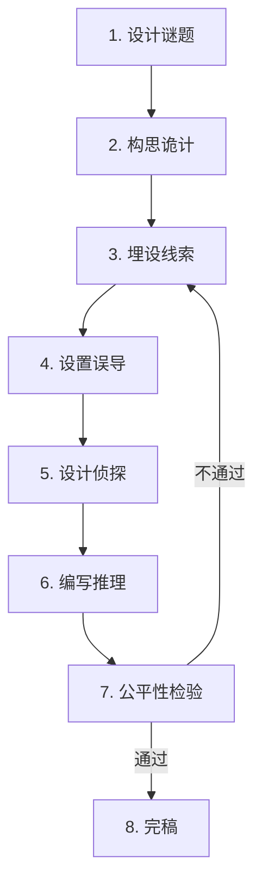

# 本格推理核心要素 (Core Elements of Fair-Play Mystery)

> **核心原则**: 本格推理的本质是"读者与侦探的智力游戏"——所有线索必须公平呈现，真相必须可推导。

---

## 1. 什么是本格推理？

### 定义
**本格推理（Honkaku Mystery）**：又称"正统推理"或"公平竞技推理"，强调**逻辑推理**和**线索公平性**。读者与侦探处于同一信息起跑线，理论上可在揭晓前推导出真相。

### 与社会派/冷硬派的区别
| 类型 | 核心 | 重点 | 示例 |
|------|------|------|------|
| **本格推理** | 谜题解答 | 密室/诡计/逻辑 | 《暴风雪山庄》 |
| **社会派** | 人性/动机 | 犯罪原因/社会批判 | 《白夜行》 |
| **冷硬派** | 氛围/暴力 | 侦探历险/黑色风格 | 《马耳他之鹰》 |

---

## 2. 本格推理的"十诫"（改良版诺克斯十诫）

### 原版诺克斯十诫（Knox's Ten Commandments, 1929）
经典规则，但部分已过时。以下为**网文适配版**：

**诫律1**: 罪犯必须在故事早期登场  
**诫律2**: 超自然力量禁止用于真相解释（但可以用于误导）  
**诫律3**: 密室最多只能有一个秘密通道  
**诫律4**: 未知毒药或需要长篇科学解释的装置禁用  
**诫律5**: 不能有中国人角色（原版种族歧视，**已废弃**）→ **改为：不能有完全未登场的神秘人作为凶手**  
**诫律6**: 侦探不能依靠偶然或第六感破案  
**诫律7**: 侦探本人不能是罪犯（除非双侦探设定）  
**诫律8**: 侦探必须向读者公开所有线索  
**诫律9**: 侦探的助手（华生角色）的思考必须向读者透明  
**诫律10**: 双胞胎/分身必须在前期明示  

---

## 3. 本格推理的四大支柱

### 支柱1：公平性（Fair Play）
**定义**: 读者与侦探拥有相同的信息，理论上可以推理出真相。

**实现方法**:
```
✅ 正确示例
第10章: 侦探发现花瓶碎片（读者同时看到）
第20章: 侦探推理："花瓶是从内部打碎的"
→ 读者可以回顾第10章验证

❌ 错误示例
第10章: 侦探发现一个线索（未描述内容）
第20章: 侦探说："我早就发现了这个关键证据！"
→ 读者无法验证，不公平
```

---

### 支柱2：逻辑性（Logic）
**定义**: 推理过程必须符合逻辑，不能靠直觉或巧合。

**逻辑链示例**:
```markdown
## 案例：密室杀人
**已知线索**:
1. 死者在上锁的房间内
2. 窗户从内部锁死
3. 死者手持钥匙

**错误推理**:
"我有预感，凶手是隔壁的张三"
→ 无逻辑依据

**正确推理**:
1. 死者手持钥匙 → 他可能自己锁门
2. 窗户内锁 → 凶手未从窗户逃离
3. 房间上锁 → 凶手可能在死者锁门前已离开
4. → 推测：死者锁门后被提前藏在房内的凶手杀害
5. → 寻找房内可藏身的地点（衣柜/床下/天花板）
```

---

### 支柱3：可解性（Solvability）
**定义**: 真相必须是读者**有可能**推理出来的，而非完全意外。

**可解性标准**:
- ✅ 读者事后恍然大悟："原来是这样！"
- ❌ 读者事后仍困惑："什么？这也行？"

**示例**:
```markdown
✅ 可解的反转
线索: 死者日记写着"7月15日见到了他"
真相: "他"指的是凶手，日记是证据

❌ 不可解的反转
真相: 死者有个从未提及的双胞胎兄弟
→ 读者无从推测
```

---

### 支柱4：意外性（Surprise）
**定义**: 真相既符合逻辑，又出人意料。

**平衡公式**:
```
公平性（80%线索） + 隐藏性（20%误导） = 意外性
```

**示例**:
```markdown
## 案例：《东方快车谋杀案》（阿加莎·克里斯蒂）
**线索公平**: 12个嫌疑人都有不在场证明
**误导**: 暗示凶手是外来者
**真相**: 12人集体作案
**意外性**: 颠覆"凶手是一人"的常识
```

---

## 4. 本格推理的五大要素

### 要素1：谜题（Mystery）
**定义**: 核心悬念，推动读者继续阅读。

**常见谜题类型**:
| 类型 | 问题 | 示例 |
|------|------|------|
| **Who（谁）** | 凶手是谁？ | 封闭空间多人，找出凶手 |
| **How（如何）** | 如何做到的？ | 密室杀人，如何逃脱 |
| **Why（为何）** | 动机是什么？ | 看似无冤无仇，为何杀人 |
| **When（何时）** | 案发时间？ | 伪造不在场证明 |
| **Where（何地）** | 案发地点？ | 尸体被移动，真正现场在哪 |

---

### 要素2：线索（Clues）
**定义**: 指向真相的证据，必须**公平呈现**。

**线索分类**:
```markdown
## 物证
- 凶器、指纹、血迹、毛发、纤维
- 时间证据（手表停止、日记日期）
- 空间证据（脚印方向、物品位置）

## 人证
- 目击证言（可能虚假）
- 专家鉴定（法医、化验师）

## 行为证据
- 嫌疑人的异常举动
- 不在场证明的破绽
```

**线索埋设技巧**:
```
1. 前置埋设: 在案发前章节"不经意"提及关键物品
2. 伪装成背景: 把线索藏在环境描写中
3. 多次提及: 重要线索出现2-3次，加深印象
```

---

### 要素3：红鲱鱼（Red Herring，误导）
**定义**: 故意设置的虚假线索，引导读者做出错误推理。

**示例**:
```markdown
## 案例：指向无辜者的证据
线索A: 张三的刀上有血迹
线索B: 张三曾与死者争吵
→ 读者推测：张三是凶手

真相: 张三是猎人，刀上是动物血
     争吵是因为债务，与谋杀无关
→ 真凶另有其人
```

**注意**: 红鲱鱼必须**事后可解释**，不能毫无逻辑。

---

### 要素4：侦探（Detective）
**定义**: 推理的执行者，代表读者的视角。

**侦探类型**:
| 类型 | 特点 | 示例 |
|------|------|------|
| **天才型** | 超凡逻辑，冷静理性 | 福尔摩斯 |
| **老实人型** | 依靠常识和踏实调查 | 布朗神父 |
| **业余型** | 非职业侦探，误打误撞破案 | 杰西卡·弗莱彻 |

**网文常见设定**:
- 重生侦探（知道部分真相，但需重新推理）
- 系统辅助侦探（获得线索提示）
- 双侦探（一明一暗，最后合作）

---

### 要素5：真相揭示（Revelation）
**定义**: 侦探公开推理过程，解释所有疑点。

**揭示结构**:
```markdown
## 标准三段式
1. 回顾案情（30%）: 梳理已知线索
2. 逐点破解（50%）: 逐一排除嫌疑，指出红鲱鱼
3. 指认凶手（20%）: 揭示核心诡计，指认真凶
```

**揭示技巧**:
```
✅ 层层递进: 先破解小谜题，再揭示核心
✅ 制造反转: 先指向A，再突然转向B
✅ 留悬念: 解释80%，留20%让读者自己思考

❌ 一次性倾倒: 把所有信息一口气说完
❌ 侦探全知: 侦探事先知道但不说
```

---

## 5. 本格推理的创作流程

### 流程图


---

### Step 1: 设计谜题
**核心问题**: 你想让读者猜什么？

**示例**:
```
谜题: 密室杀人——凶手如何在上锁房间杀人后逃脱？
```

---

### Step 2: 构思诡计
**核心问题**: 真相是什么？如何做到的？

**示例**:
```
诡计: 凶手提前藏在房内壁橱，杀人后伪装成第一发现者
```

---

### Step 3: 埋设线索
**核心问题**: 如何让读者**有可能**推理出真相？

**示例**:
```
线索1（第5章）: 壁橱门有轻微划痕
线索2（第10章）: 第一发现者衣服上有灰尘
线索3（第15章）: 壁橱内发现一根头发
```

---

### Step 4: 设置误导
**核心问题**: 如何让读者**不那么容易**猜到真相？

**示例**:
```
红鲱鱼1: 窗外有脚印（实际是园丁的）
红鲱鱼2: 死者手持遗书（实际是自杀假象）
```

---

### Step 5: 设计侦探
**核心问题**: 由谁来推理？性格如何？

**示例**:
```
侦探: 退休警探，经验丰富但不善言辞
特点: 通过观察细节破案，而非天才直觉
```

---

### Step 6: 编写推理
**核心问题**: 侦探如何一步步接近真相？

**示例**:
```
第20章: 发现壁橱划痕，怀疑有人藏过
第25章: 发现第一发现者撒谎
第30章: 揭示真相
```

---

### Step 7: 公平性检验
**检查清单**:
- [ ] 所有关键线索都已向读者呈现？
- [ ] 推理过程符合逻辑？
- [ ] 没有依赖读者不知道的信息？
- [ ] 红鲱鱼都可以合理解释？
- [ ] 真相既意外又合理？

---

## 6. 本格推理的常见陷阱

### 陷阱1：信息不对等
**错误示例**:
```
侦探（心想）：我早就知道凶手是谁了。
→ 读者无法同步推理
```

**正确做法**:
```
侦探（心想）：壁橱的划痕……难道……
→ 暗示推理方向，但不直接说出
```

---

### 陷阱2：逻辑跳跃
**错误示例**:
```
线索: 现场有根头发
侦探: 所以凶手是张三！
→ 缺少中间推理步骤
```

**正确做法**:
```
线索: 现场有根头发
侦探: 这根头发是黑色长发
     现场只有3名女性
     其中2人是短发
     → 推测：凶手是长发女性李四
```

---

### 陷阱3：过度依赖巧合
**错误示例**:
```
侦探碰巧看到凶手在处理凶器
→ 靠运气破案
```

**正确做法**:
```
侦探通过追踪线索，推理出凶器藏匿地点
→ 靠逻辑破案
```

---

### 陷阱4：真相过于复杂
**错误示例**:
```
真相: 凶手利用量子力学原理制造密室
→ 读者完全无法理解
```

**正确做法**:
```
真相: 凶手利用冰块固定门栓，融化后门自动上锁
→ 简单但巧妙
```

---

## 7. 本格推理自检清单

**写完后逐项检查**:
- [ ] 谜题是否足够吸引人？
- [ ] 所有线索是否公平呈现？
- [ ] 推理逻辑是否严密？
- [ ] 红鲱鱼是否事后可解释？
- [ ] 真相是否既意外又合理？
- [ ] 侦探的推理过程是否清晰？
- [ ] 有没有违反"十诫"？
- [ ] 读者是否**有可能**推理出真相？

---

## 🛠️ 本格推理速查表

| 要素 | 关键点 | 常见错误 | 正确做法 |
|------|--------|---------|---------|
| **谜题** | 吸引人的悬念 | 谜题太简单 | 多层谜题 |
| **线索** | 公平呈现 | 关键线索隐藏 | 至少呈现2次 |
| **诡计** | 既巧妙又可解 | 过于复杂 | 简单原理 |
| **推理** | 逻辑严密 | 跳跃推理 | 逐步推导 |
| **揭示** | 层层递进 | 一次性倾倒 | 分段揭示 |

---

## 附录：经典本格推理案例

### 案例1：《暴风雪山庄》（东野圭吾）
**谜题**: 封闭山庄内连环杀人，凶手是谁？  
**诡计**: 被害者其实是凶手，伪装成被害  
**公平性**: 所有线索均已呈现，读者可推理  

---

### 案例2：《无人生还》（阿加莎·克里斯蒂）
**谜题**: 孤岛上10人逐一被杀，凶手是谁？  
**诡计**: 法官假死，最后自杀  
**公平性**: 童谣暗示杀人顺序，所有线索公开  

---

## 总结

**本格推理 = 公平性 + 逻辑性 + 可解性 + 意外性**

记住：本格推理的核心不是"炫技"，而是"公平竞技"。读者与侦探站在同一起跑线，享受推理的乐趣。
